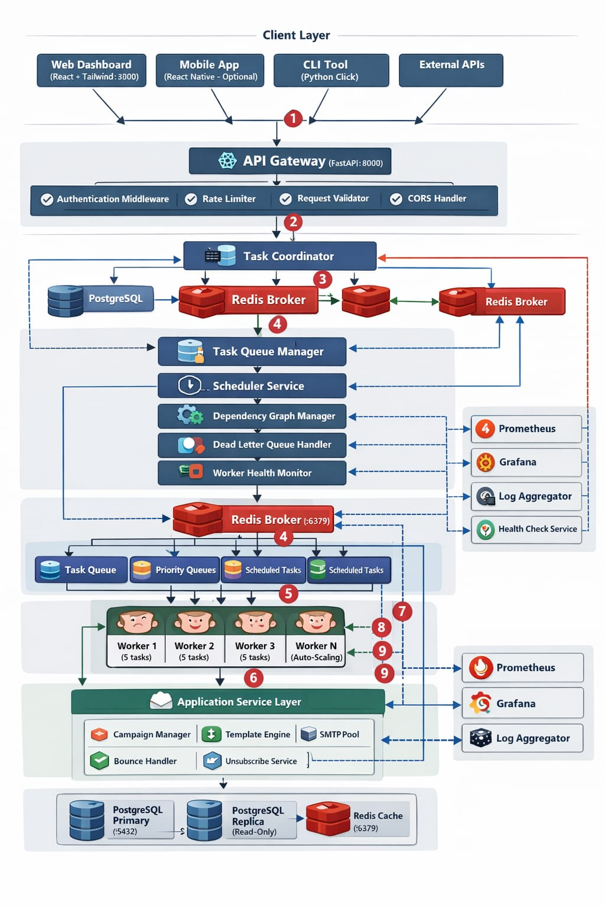

ARCHITECTURE OVERVIEW :

LAYER 1 - CLIENT LAYER (Top):
- Component: "Web Dashboard" (React + Tailwind CSS, port 3000)
- Component: "Mobile App" (React Native - Optional)
- Component: "CLI Tool" (Python Click)
- Component: "External APIs" (Third-party integrations)

All client components connect downward with HTTPS to API Gateway

LAYER 2 - API GATEWAY LAYER:
- Component: "API Gateway" (FastAPI, port 8000)
  - Sub-component: "Authentication Middleware" (JWT validation)
  - Sub-component: "Rate Limiter" (100 requests/minute per user)
  - Sub-component: "Request Validator" (Pydantic schemas)
  - Sub-component: "CORS Handler"
  - Sub-component: "Logging Middleware"

API Gateway connects to:
- Task Coordinator (bidirectional)
- PostgreSQL (read/write)
- Redis (read/write)

LAYER 3 - CORE ORCHESTRATION LAYER:
- Component: "Task Coordinator" (Python service)
  - Sub-component: "Priority Queue Manager"
  - Sub-component: "Scheduler Service" (cron-like)
  - Sub-component: "Dependency Graph Manager"
  - Sub-component: "Dead Letter Queue Handler"
  - Sub-component: "Worker Health Monitor"

Task Coordinator connects to:
- Redis Broker (bidirectional)
- PostgreSQL (read/write)
- All Worker Nodes (management channel)

LAYER 4 - MESSAGE BROKER:
- Component: "Redis Broker" (port 6379)
  - Sub-component: "Task Queue" (Redis Streams)
  - Sub-component: "Priority Queues" (Sorted Sets)
  - Sub-component: "Scheduled Tasks" (Sorted Set with timestamps)
  - Sub-component: "Worker Registry" (Hash)
  - Sub-component: "Rate Limit Counters" (String with TTL)

LAYER 5 - WORKER POOL:
- Component Group: "Worker Nodes" (5+ instances)
  - Worker 1 (capacity: 5 concurrent tasks)
  - Worker 2 (capacity: 5 concurrent tasks)
  - Worker 3 (capacity: 5 concurrent tasks)
  - Worker N (auto-scaling)

Each worker has:
- Task Executor
- Heartbeat Sender (every 10 seconds)
- Result Publisher

Workers connect to:
- Redis Broker (pull tasks)
- PostgreSQL (write results)
- Email Service Layer (for email tasks)

LAYER 6 - APPLICATION SERVICE LAYER:
- Component: "Email Campaign Service"
  - Sub-component: "Campaign Manager"
  - Sub-component: "Template Engine" (Jinja2)
  - Sub-component: "SMTP Connection Pool"
  - Sub-component: "Bounce Handler"
  - Sub-component: "Unsubscribe Service"

Email Service connects to:
- PostgreSQL (campaign data)
- External SMTP servers (Gmail, SendGrid)

LAYER 7 - DATA PERSISTENCE LAYER:
- Component: "PostgreSQL Primary" (port 5432)
  - Tables: tasks, workers, campaigns, email_recipients, task_logs, dlq
- Component: "PostgreSQL Replica" (read-only, optional)
- Component: "Redis Cache" (shared with broker, port 6379)

LAYER 8 - OBSERVABILITY LAYER (Side):
- Component: "Prometheus" (port 9090, metrics collection)
- Component: "Grafana" (port 3001, visualization)
- Component: "Log Aggregator" (Elasticsearch/Loki - optional)
- Component: "Health Check Service" (monitors all components)

Observability connects to:
- API Gateway (scrape /metrics)
- Task Coordinator (scrape /metrics)
- All Workers (scrape /metrics)
- PostgreSQL (pg_exporter)
- Redis (redis_exporter)

CONNECTIONS:
- Solid arrows: synchronous communication
- Dashed arrows: asynchronous communication
- Red arrows: failure/retry flows
- Green arrows: success flows
- Blue arrows: monitoring data flows

DATA FLOW (annotate with numbers):
1. Client → API Gateway: Submit task via POST /tasks
2. API Gateway → PostgreSQL: Insert task record
3. API Gateway → Redis: Push task to queue
4. Task Coordinator → Redis: Monitor queue
5. Worker → Redis: BLPOP task from queue
6. Worker → PostgreSQL: Update task status to RUNNING
7. Worker → Email Service: Execute email sending
8. Worker → PostgreSQL: Store task result
9. Worker → Redis: Publish completion event
10. API Gateway → Client: WebSocket notification

